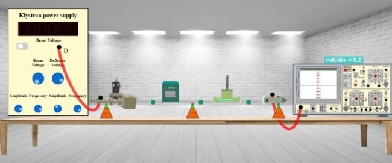
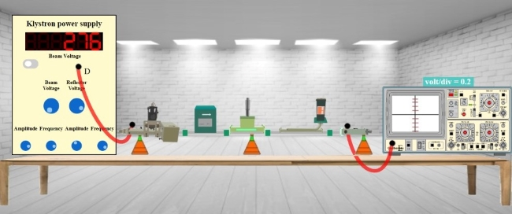
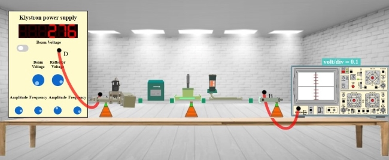

## Procedure 

### Instructions to Record the Value for V1

**Step-1:** Click on Components button for components to pop up.  
**Step-2:** Click on the "Components", drag them to the test bench and place them as shown in fig. 1.  
  

**Fig. 1 Setup for recording V1 values**

**Step-3:** After placing the components on the test bench, connect the wires accordingly.  
**Step-4:** If your connections are correct then you may continue to take down the readings, if not then click on "Reset Button" and try it again.  
**Step-5:** Move the "Beam Voltage" knob and set it to 250 or above to record your readings.  
**Step-6:** Toggle the switch button and move the "Reflector Voltage" knob to set the reflector voltage to maximum negative value.  
**Step-7:** As soon as you start varying the reflector voltage you will observe a waveform on CRO.  
**Step-8:** Keep varying the "Reflector voltage" till you get square waveform on CRO (You will get square waveforms at these values 150, 164, 199 and 233 of voltage.).  
**Step-9:** As soon as you observe square waveform on CRO, count the division covered by the square waveform.  
**Step-10:** Note down the number of division in input box for V1.  
**Step-11:** Click on "Add to table" button to record the readings for V1, Beam Voltage and Reflector Voltage.  
**Step-12:** Click on "Print" button to print your current page (readings and connections) or to save your page (readings and connections) in a PDF form. After clicking on "Print Button" set the layout as "Landscape" to get a proper view of the page then go to more settings and click on the checkbox named "Background graphics".  
**Step-13:** Click on "Next" button.

  
  
  

### Instructions to Record the Value for V2

**Step-1:** Click on Components button for components to pop up.  
**Step-2:** Click on the "Components", drag them to the test bench and place them as shown in fig. 2.  
  

**Fig. 2 Setup for recording V2 values**

  

**Step-3:** After placing the components on the test bench, connect the wires accordingly.  
**Step-4:** If your connections are correct then you may continue to take down the readings, if not then click on "Reset Button" and try it again.  
**Step-5:** Toggle the switch button and observe the waveform on CRO for same value of Reflector Voltage.  
**Step-6:** Now the waveform observed will be different as we are using a directional coupler.  
**Step-7:** Note down the number of division in input box for V2.  
**Step-8:** Click on "Add to table" button to record the readings for V2.  
**Step-9:** Click on "Print" button to print your current page (readings and connections) or to save your page (readings and connections) in a PDF form. After clicking on "Print Button" set the layout as "Landscape" to get a proper view of the page then go to more settings and click on the checkbox named "Background graphics".  
**Step-10:** Click on "Next" button.

### Instructions to Record the Value for V4

**Step-1:** Click on Components button for components to pop up.  
**Step-2:** Click on the "Components", drag them to the test bench and place them as shown in fig. 3.  
  

**Fig. 3 Setup for recording V4 values**

**Step-3:** After placing the components on the test bench, connect the wires accordingly.  
**Step-4:** If your connections are correct then you may continue to take down the readings, if not then click on "Reset Button" and try it again.  
**Step-5:** Toggle the switch button and observe the waveform on CRO for same value of Reflector Voltage.  
**Step-6:** Now the waveform observed will be different as we are using an inverted directional coupler.  
**Step-7:** Note down the number of division in input box for V4.  
**Step-8:** Click on "Add to table" button to record the readings for V4.  
**Step-9:** Click on "Calculate" button to get the values of Coupling factor and Directivity of directional coupler.  
**Step-10:** Click on "Print" button to print your current page (readings and connections) or to save your page (readings and connections) in a PDF form. After clicking on "Print Button" set the layout as "Landscape" to get a proper view of the page then go to more settings and click on the checkbox named "Background graphics".

