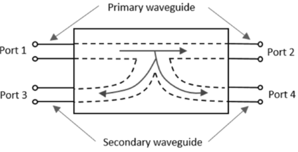
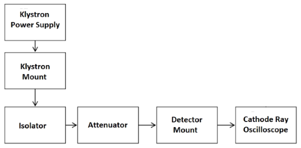
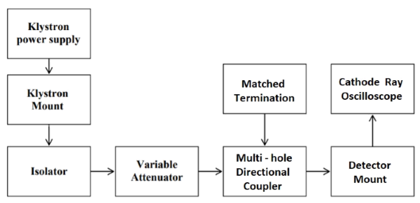
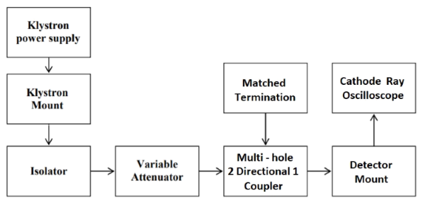

### Introduction

A Directional coupler is a device that samples a small amount of Microwave power for measurement purposes. The power measurements include incident power, reflected power, VSWR values, etc. Directional Coupler is a 4-port waveguide junction consisting of a primary main waveguide and a secondary auxiliary waveguide. The following figure shows the image of a directional coupler.  

**Fig. 1 Directional Coupler**

1.  It consists of two transmission lines the primary arm and secondary arm, electro-magnetically coupled to each other. The power entering the primary arm gets divided between port 2 and 3 and almost no power comes out in port 4. Power entering at port 2 is divided between port 1 and 4. The coupling factor is defined as: 

$$
Coupling \ C \ (dB) = {10log_{10}} \frac{P1}{P3} = {20log_{10}} \frac{V1}{V3}
$$

&emsp;&emsp;&emsp;where, port 2 is terminated. 

$$
Isolation \ I \ (dB) = {10log_{10}} \frac{P2}{P3} = {20log_{10}} \frac{V2}{V3}
$$

&emsp;&emsp;&emsp;where, port 1 is matched.

2.  With built in termination and power entering at port 1, the directivity of coupler is a measure of separation between incident and reflected wave. Directivity is measured as follows:  
    Hence 

$$
Directivity \ D \ (dB) = {10log_{10}} \frac{P2}{P1} = {20log_{10}} \frac{V2}{V1} = I-C
$$ 

### Block Diagram

*   ### **For V1 Voltage:**
    

    
    
    **Fig. 2 Bench setup for V1 Voltage**
    

    
*   ### **For Coupling Factor:**
    

    
    
    **Fig. 3 Bench setup for coupling factor**
    

    
*   ### **For Directivity:**
    

    
    
    
    **Fig. 4 Bench setup for directivity**
    

    

