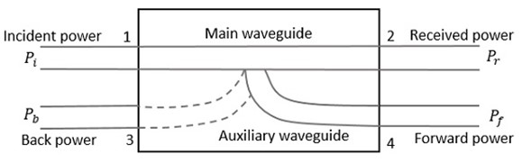

### Introduction

A Directional coupler is a device that samples a small amount of Microwave power for measurement purposes. The power measurements include incident power, reflected power, VSWR values, etc. Directional Coupler is a 4-port waveguide junction consisting of a primary main waveguide and a secondary auxiliary waveguide. The following figure shows the image of a directional coupler.  

**Fig. 1 Directional Coupler**

#### Properties of Directional Couplers
The properties of an ideal directional coupler are as follows

* All terminations are matched to the ports.

* When power travels from Port 1 to Port 2, a portion of it couples to Port 4 but not to Port 3.

* As it is a bi-directional coupler, when power travels from Port 2 to Port 1, a portion of it couples to Port 3 but not to Port 4.

* If power is incident through Port 3, a portion of it couples to Port 2 but not to Port 1.

* If power is incident through Port 4, a portion of it couples to Port 1 but not to Port 2.

* Port 1 and Port 3 are decoupled, as are Port 2 and Port 4.

Ideally, the output of Port 3 should be zero. However, in practice, a small amount of power, known as back power, is observed at Port 3. The figure below illustrates the power flow in a directional coupler.

**Fig. 2 Directional Coupler Indicating Powers**

Where

* Pi = Incident power at Port 1
* Pr = Received power at Port 2
* Pf = Forward coupled power at Port 4
* Pb = Back power at Port 3

Following are the parameters used to define the performance of a directional coupler.

### 1. Coupling Factor (C)

The Coupling factor of a directional coupler is the ratio of incident power to the forward power, measured in dB.

 <math style='font-size:20px'>
            <mrow>
                    <mi>C</mi>  
                <mo>=</mo>
               <mi>10</mi>
                <msub subscriptshift="5px">
                        <mi>log</mi>
                        <mn>10</mn>
                    </msub>
                <mfrac>
                <msub subscriptshift="5px">
                        <mi>P</mi>
                        <mn>i</mn>
                    </msub>
                    <msub subscriptshift="5px">
                        <mi>P</mi>
                        <mn>f</mn>
                    </msub>
                </mfrac>
                <mi> dB</mi>
            </mrow>
    </math>
         -----------------(1)

 

To express the coupling factor (C) in terms of voltage (V), assuming voltage is proportional to power (since 𝑃∝𝑉2),

 <math style='font-size:20px'>
            <mrow>
                    <mi>C</mi>  
                <mo>=</mo>
               <mi>20</mi>
                <msub subscriptshift="5px">
                        <mi>log</mi>
                        <mn>10</mn>
                    </msub>
                <mfrac>
                          <msub subscriptshift="5px">
                        <mi>V</mi>
                        <mn>i</mn>
                    </msub>
                    <msub subscriptshift="5px">
                        <mi>V</mi>
                        <mn>f</mn>
                    </msub>
                </mfrac>
                <mi> dB</mi>
            </mrow>
    </math>
    -----------------(2)

### 2. Directivity (D)
The Directivity of a directional coupler is the ratio of forward power to the back power, measured in dB.

     <math style='font-size:20px'>
            <mrow>
                    <mi>D</mi>  
                <mo>=</mo>
               <mi>10</mi>
                <msub subscriptshift="5px">
                        <mi>log</mi>
                        <mn>10</mn>
                    </msub>
                <mfrac>
                        <msub subscriptshift="5px">
                        <mi>P</mi>
                        <mn>f</mn>
                    </msub>
                    <msub subscriptshift="5px">
                        <mi>P</mi>
                        <mn>b</mn>
                    </msub>
                </mfrac>
                </mfrac>
                <mi> dB</mi>
            </mrow>
    </math>
    -----------------(3)

 

The Directivity (D) in terms of voltage (V) can be written as:

     <math style='font-size:20px'>
            <mrow>
                    <mi>D</mi>  
                <mo>=</mo>
               <mi>20</mi>
                <msub subscriptshift="5px">
                        <mi>log</mi>
                        <mn>10</mn>
                    </msub>
                <mfrac>
                         <msub subscriptshift="5px">
                        <mi>V</mi>
                        <mn>f</mn>
                    </msub>
                    <msub subscriptshift="5px">
                        <mi>V</mi>
                        <mn>b</mn>
                    </msub>
                </mfrac>
                <mi> dB</mi>
            </mrow>
    </math>
    -----------------(4)

### 3. Isolation (I)
It defines the directive properties of a directional coupler. It is the ratio of incident power to the back power, measured in dB.

    <math style='font-size:20px'>
            <mrow>
                    <mi>I</mi>  
                <mo>=</mo>
               <mi>10</mi>
                <msub subscriptshift="5px">
                        <mi>log</mi>
                        <mn>10</mn>
                    </msub>
                <mfrac>
                        <msub subscriptshift="5px">
                        <mi>P</mi>
                        <mn>i</mn>
                    </msub>
                    <msub subscriptshift="5px">
                        <mi>P</mi>
                        <mn>b</mn>
                    </msub>
                </mfrac>
                <mi> dB</mi>
            </mrow>
    </math>
    -----------------(5)

 

The Isolation (I) in terms of voltage (V) can be written as:

    <math style='font-size:20px'>
            <mrow>
                    <mi>I</mi>  
                <mo>=</mo>
               <mi>20</mi>
                <msub subscriptshift="5px">
                        <mi>log</mi>
                        <mn>10</mn>
                    </msub>
                <mfrac>
                         <msub subscriptshift="5px">
                        <mi>V</mi>
                        <mn>i</mn>
                    </msub>
                    <msub subscriptshift="5px">
                        <mi>V</mi>
                        <mn>b</mn>
                    </msub>
                </mfrac>
                <mi> dB</mi>
            </mrow>
    </math>
    -----------------(6)

 

    <math style='font-size:20px'>
            <mrow>
                    <mi>I</mi>  
                <mo>=</mo>
               <mi>C</mi>
               <mo>+</mo>
               <mi>D</mi>
            </mrow>
    </math>
    -----------------(7)

 

### Component List

1. **Klystron Power Supply**  
Provides the necessary high voltage and current to the klystron tube, which generates the microwave signals required for the directional coupler tests.

2. **Klystron Mount**  
Holds the klystron securely in place, ensuring stability and proper alignment with other components during experiments.

3. **Isolator**  
Prevents reflected signals from returning to the klystron, protecting it from potential damage and ensuring stable operation by maintaining unidirectional signal flow.

4. **Attenuator**  
Allows for precise control of the microwave signal power entering the directional coupler, enabling adjustments to analyze the effects of varying input power on the coupler's performance.

5. **Multi-hole Directional Coupler**  
A microwave device that samples a portion of the input signal while allowing the majority to pass through. It is key for studying the coupling factor and isolation characteristics of the coupler.

6. **Matched Termination**  
Absorbs any excess microwave power at the unused port of the coupler, preventing reflections and ensuring accurate measurements of the coupled and transmitted signals.

7. **Detector Mount**  
Holds the detector that measures the output power from the coupler, providing essential data for calculating the coupling factor and assessing the performance of the directional coupler.

8. **Cathode Ray Oscilloscope (CRO)**  
Visualizes the output signal waveforms, allowing for analysis of amplitude, frequency, and phase relationships, which are critical for evaluating the characteristics of the directional coupler.

### Block Diagram

*   ### **For V1 Voltage:**
    

    
    
    **Fig. 3 Bench setup for V1 Voltage**
    

    
*   ### **For Coupling Factor:**
    

    
    
    **Fig. 4 Bench setup for coupling factor**
    

    
*   ### **For Directivity:**
    

    
    
    
    **Fig. 5 Bench setup for directivity**
    

    

